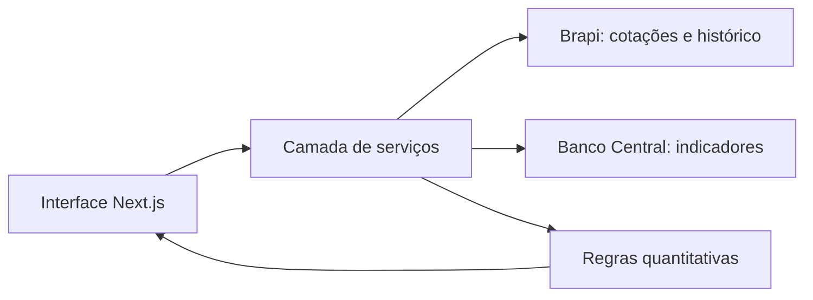

# Mercado Insights

Plataforma web para análise quantitativa do mercado financeiro brasileiro, construída com Next.js, TypeScript e Tailwind CSS.

[Acessar aplicação](https://mercadoinsights.netlify.app/dashboard)

## Visão Geral

O Mercado Insights centraliza cotações, gráficos, simulações, alertas e análises de carteira em uma interface única. A proposta é apoiar decisões financeiras com dados estruturados, regras transparentes e uma experiência simples para acompanhar ativos da B3.

O projeto combina integrações com APIs públicas e privadas, cálculos determinísticos e componentes visuais responsivos para transformar dados de mercado em informações mais fáceis de comparar e interpretar.

## Principais Recursos

| Área | O que faz |
| --- | --- |
| Dashboard | Exibe preço, volume, variação diária, market cap, gráfico histórico, maiores movimentos e oportunidades quantitativas. |
| Busca de ativos | Permite consultar ativos da B3 e atualizar os indicadores principais do painel. |
| Análise de portfólio | Calcula valor total, alocação, exposição por ativo, setor e tipo, além de diagnóstico por regras de risco. |
| Renda fixa | Simula projeções com juros compostos usando taxa manual ou indicadores como Selic, CDI e IPCA. |
| Notícias | Classifica notícias por termos positivos e negativos, sem envio de conteúdo para serviços externos de IA. |
| Backtesting | Testa estratégias com IFR, cruzamento de médias móveis e rompimento de resistência sobre histórico de preços. |
| Alertas | Cria alertas de preço persistidos no navegador e compara com a cotação atual. |
| Tema claro/escuro | Interface adaptada para uso em diferentes condições de leitura. |

## Arquitetura



## Stack

- Next.js 16 com App Router
- React 18
- TypeScript
- Tailwind CSS
- ShadCN UI e Radix UI
- Recharts
- Lucide React
- Brapi para dados de mercado
- Banco Central do Brasil para indicadores macroeconômicos

## Como Rodar Localmente

### Pré-requisitos

- Node.js 20 ou superior
- npm
- Chave da Brapi para dados reais

### Instalação

```bash
npm install
```

### Variáveis de ambiente

Crie um arquivo `.env` na raiz do projeto:

```env
BRAPI_API_KEY=sua-chave-de-api-aqui
```

Sem essa variável, a aplicação usa dados demonstrativos locais.

### Desenvolvimento

```bash
npm run dev
```

A aplicação fica disponível em:

```text
http://localhost:9002
```

## Scripts

| Comando | Descrição |
| --- | --- |
| `npm run dev` | Inicia o servidor de desenvolvimento na porta 9002. |
| `npm run build` | Gera a build de produção. |
| `npm run start` | Inicia o servidor de produção após o build. |
| `npm run typecheck` | Executa a validação TypeScript. |

## Estrutura do Projeto

```text
src/
  app/              Rotas, layouts e APIs do Next.js
  components/       Componentes de interface e módulos do painel
  hooks/            Hooks compartilhados
  lib/              Utilitários e tipos de domínio
  services/         Integrações, cálculos e regras de negócio
public/             Imagens e arquivos estáticos
docs/               Documentação complementar
```

## Aviso

As informações exibidas são apenas educativas e informativas. O projeto não fornece recomendação individualizada de investimento, consultoria financeira ou garantia de resultado.

## Autor

Desenvolvido por Daniel Barbieri, IronDev Software.
